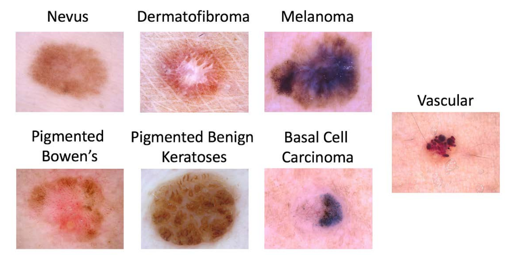

# Computer Aided Diagnosis of Skin Lesions

The repository contains results and code for the project skin lesion classification, which includes 2 challenges:

* Challenge 1: Binary classification: Nevus vs. Others
* Challenge 2: Three class problem: Basal Cell vs. Squamous Cell vs. Melanoma
___
**Our solution ranked top-1 on a private leaderboard for the binary classification challenge for both ML and DL implementations while our DL also solution ranked top 3 for the 3-class imbalanced problem**

### The presentation of results and approaches can be seen in following pdfs:
* [Part 1: ML and Bag of Visual Words](reports/CAD_%20Skin%20Lesion%20Project%201.pdf)
    * Manual feature engineering, extraction and analysis of ABCD rule features and their importance, lesion segmentation and hair removal pipelines (with grayscale morphology), experiments with the custom Bag of Visual Words implementation on subsets of features and final model ensembling and tackling the imbalances

* [Part 2: Deep Learning and pretext training](reports/_CAD_%20Skin%20Lesion%20Project%202.pdf)
    * Comparison between the best CNN (RegNetY) and transformer (Swin) model's performances; models and loss tuning; bottleneck embedding fusion experiments and pretext training on a subset of classes
___
The data for the challenge was provided by the course organizers. It consisted of images from HAM10000 Dataset (ViDIR Group, Medical University of Vienna), the BCN_20000 Dataset (Hospital Clínic de Barcelona) and the MSK Dataset (ISBI 2017).

For the binary classification problem we had ~15,000 images while for the highly imbalanced 3-class only ~5,000 images from following categories.



# Contributors
* Vladyslav Zalevskyi [GitHub](https://github.com/Vivikar) | [LinkedIn](https://www.linkedin.com/in/vlad-zalevskyi/)
* Manasi Kattel [GitHub](https://github.com/manasikattel) | [LinkedIn](https://www.linkedin.com/in/manasi-kattel/)


# Reproduction details
## Set up the environment

Rung following code to set up a conda environment with all the packages needed to run the project.

```
conda update -n base -c defaults conda &&
conda create -n cad_skin anaconda &&
conda activate cad_skin && 
pip install -r requirements.txt
```

## Download the data
Run `skin-lesion-cad/data/make_dataset.py` to download data sets and extract them into corresponding folders
```
python skin-lesion-cad/data/make_dataset.py
```
Or alternatively, download the data sets manually and extract them into corresponding folders.

At the end the following structure of the `/data` folder should be created:
```
data/
├── processed
└── raw
    ├── chall1
    │   ├── train
    │   │   ├── nevus
    │   │   └── others
    │   └── val
    │       ├── nevus
    │       └── others
    └── chall2
        ├── train
        │   ├── bcc
        │   ├── mel
        │   └── scc
        └── val
            ├── bcc
            ├── mel
            └── scc

18 directories
```

## Segment the images

Performs basic preprocessing in images:
* hair removal
* inpainting
* segmentation

Saves inpainted image and mask in corresponding folders in the `/data/processed`.

Run script 

```$ python -m skin_lesion_cad.utils.segm_script chall1/train/nevus```

from repo root `../skin-lesion-cad$`. Parameter passed (`chall1/train/nevus`) defines which images from which folder to process.

Could also pass `--resize` option to resize images by a factor. For example to downscale image by 2 run

``` python -m skin_lesion_cad.utils.segm_script chall1/train/nevus --resize 0.5```

## Bag of Visual Words

`DenseDescriptor` and `BagofWords` class can be found in `skin_lesion_cad/data/BOVW.py`. Example and experimental notebooks for BoVW: `0.1_mk_BOVW.ipynb`, `0.3_mk_lbp_bow.ipynb`, `BoW_Fusions.ipynb`, `ColorBoW.ipynb`, `ColorBoW_3cls.ipynb`.

## Features

The code for feature classes can be found in `skin_lesion_cad/colour.py`, `skin_lesion_cad/texture.py` and `skin_lesion_cad/shape.py`. To extract and save all the features run `python -m skin_lesion_cad.features.extract_features`. Experimental notebooks for feature selection: `0.5_mk_feature_selection.ipynb` and `FeatureFusionExperiments.ipynb`.


## Training 
Ensemble class for training the models can be found in `skin-lesion-cad/data/ensemble.py`. The notebooks for tuning the models and final prediction generation: 
* Challenge 1: `1.3_mk_chall1_finalize.ipynb`, `1.4_mk_finalize_only_pred_noexp.ipynb`
* Challenge 2: `Challenge2_FinalPipeLine.ipynb`, `FinalTestResults.ipynb`, `1.2_mk_chall2_pred_test.ipynb`


# Deep Learning
Take a look at `./skin_lesion_cad/training/models` to see the DL models implementations.
## Running Experiments

1. Update corresponding config files `train_config.yaml`, `regNet.yaml` and `skin.yaml` in `skin_lesion_cad/configs/` folder. Don't forget to change the `hydra.job.name` to a unique name for each experiment.
2. Run the following command from the root of the repo `../skin-lesion-cad$` to run the experiment:
```
python3 -m skin_lesion_cad.training.train_ch1
```

## Visualizing data
1. Update the configs`train_config.yaml`, `regNet.yaml` and `skin.yaml` in `skin_lesion_cad/configs/` to display required images.
2. Run the following command from the root of the repo `../skin-lesion-cad$`
```
python3 -m skin_lesion_cad.visualization.vis_dat_simple
```
